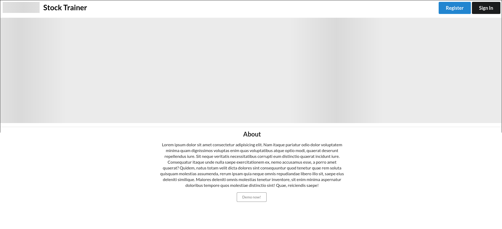
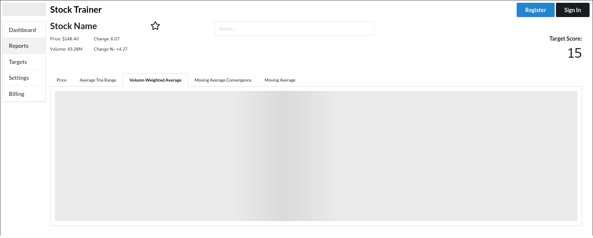
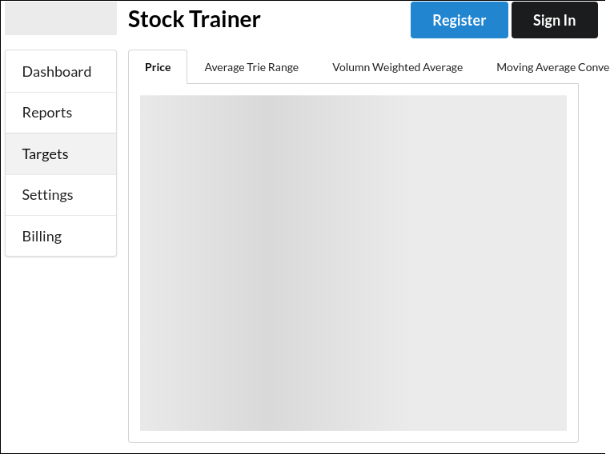
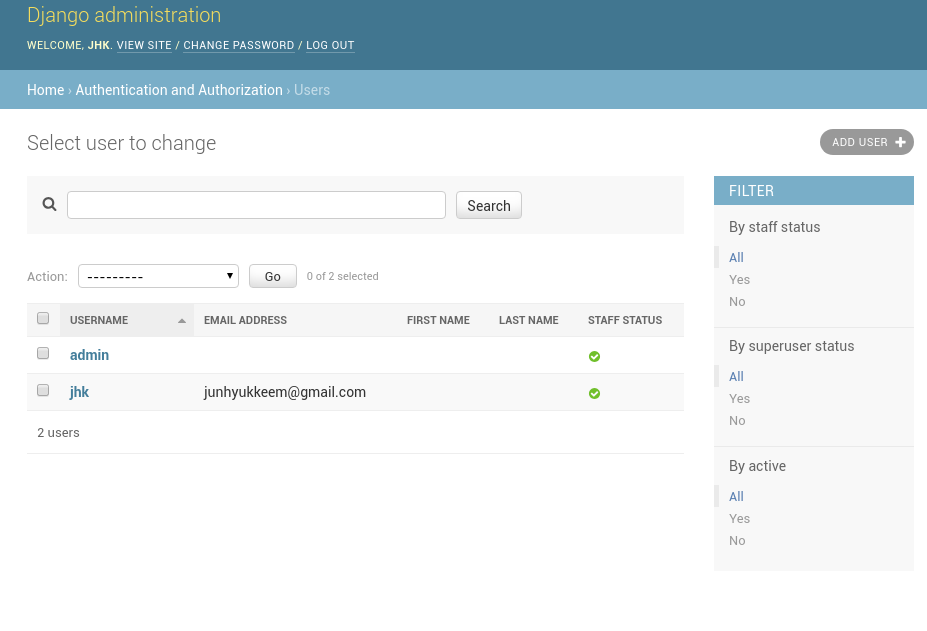

## Accomplishments 

### Github
[Repo Link](https://github.com/Lambda-School-Labs/labs9-stock-trainer/graphs/contributors)
My username on Github is [LaikaFusion](https://github.com/LaikaFusion)

### Work Summary
This week I was focuses on the front end. Everything from the rough css mockups, to the linter setup, to the hosting. For our front end we are using a combination of Eslint and Prettier to make it easy to have consistently styled code. For a ui toolkit we are using Semantic UI React, which gives us access to premade React components for things like modals and menus. To navigate between pages we are using React Router. The whole front end is hosted on Netlify.

## Tasks Pulled

### Front End

#### Task 1
Top Bar
[Github Link](https://github.com/Lambda-School-Labs/labs9-stock-trainer/pull/5)
[Trello](https://trello.com/c/WeZ3bYzJ)

This is the title bar that sits at the top of the page. It also contains the login, register, logout buttons. There is no auth system linked to it yet.

#### Task 2
Eslint and Prettier Config
[Github Link](https://github.com/Lambda-School-Labs/labs9-stock-trainer/pull/6)
[Trello](https://trello.com/c/5nIHTAad)

To enforce a consistent styling on the front end both Eslint and Prettier were configured to warn when people were deviating from our Style guidelines 

#### Task 3
Mockups
[Github Link](https://github.com/Lambda-School-Labs/labs9-stock-trainer/pull/12)
[Github Link](https://github.com/Lambda-School-Labs/labs9-stock-trainer/pull/16)
[Trello](https://trello.com/c/B1uhvH1Z)

These are rough CSS out lines for all the pages of our site. Every page in our wireframe is represented though the design is far from finalized. This was made over two PRs as it was a rather large task.

#### Task 4
Front-End Hosting
[Github Link](https://github.com/Lambda-School-Labs/labs9-stock-trainer/pull/13)
[Trello](https://trello.com/c/4aZ6MlBr)

This was just setting up and getting Netlify to serve our site. It works and allows us to preview new PRs for breaking changes

#### Task 5
React Router
[Github Link](https://github.com/Lambda-School-Labs/labs9-stock-trainer/pull/19)
[Trello](https://trello.com/c/Znbpy0fp)

Configuring React Router was essential to make it easy to view all the mock up pages.

### Back End

## Detailed Analysis

Mockups
[Github Link](https://github.com/Lambda-School-Labs/labs9-stock-trainer/pull/12)
[Github Link](https://github.com/Lambda-School-Labs/labs9-stock-trainer/pull/16)
[Trello](https://trello.com/c/B1uhvH1Z)

This week about a day and half of my time were consumed with the task of making mockups of our site. I'll be the first to admit this should have been represented better on Trello, perhaps with a checklist. 

Part of this time was getting used to Semantic UI. There are so many options, sub options and components that can make an incredibly nice looking and easily scalable site. I especially like the place holder images it has as it makes these outlines look a lot better. 

 Despite all this the formatting is held together with what feels like string and chewing gum. I was inconsistent with how I handled page layout. Sometimes I used Semantics Grid, sometimes I used Flexbox. I find Flexbox much easier to use and allowing greater customization. Perhaps during this project I will attempt to get better at CSSgrid.

The design is not finalized, not even the colors. The UI lecture on Thursday made some great suggestions that I will take in mind as time goes on. 

## Milestones

### Team

There's something terrifying about meeting a new team for the first time at least for someone who is not the best socially like myself. I seem to have lucked out, everyone in the group is very nice and seems ready and eager to pull their weight. 

I'll admit to causing friction in the group. I hate being the voice of dissent, especially to people I've just met. It needs to be done sometimes though. If everyone is nodding and agreeing with every point made. The most vocal opponent on adding React Native to our requirements. I also argued against Redux though I was not the only person with that position. It's not that I'm against trying hard or complicated things. There's a tendency I have to anticipate things going wrong and undershoot a bit to give us a bit of wiggle room incase things go wrong. 

That's not to say I spent the whole week arguing  with the group. Far from it. I tried to talk with ever member one on one at some point. This was partly to become familiar with what they're doing and the tech we're using, and partly because people have very different personalities outside of a meeting. I didn't get to talk to everyone because of the issues we're having with hosting. It felt like since I wasn't needed there I would let them work uninterrupted.

This coming week some of the initial  shock about this project will have worn off and a lot of decisions have been made.  There will be less friction and more cohesion as time goes on.

### Proofs

[Front End Proof](https://stock-trainer.netlify.com)

[Front End Navigable Portion](https://stock-trainer.netlify.com/reports)

[Backend Proof](https://backend-stock-trainer.herokuapp.com/admin/login/?next=/admin/)

[User models](https://github.com/Lambda-School-Labs/labs9-stock-trainer/pull/17)

*That's it for this week. Next week is going to be great!*