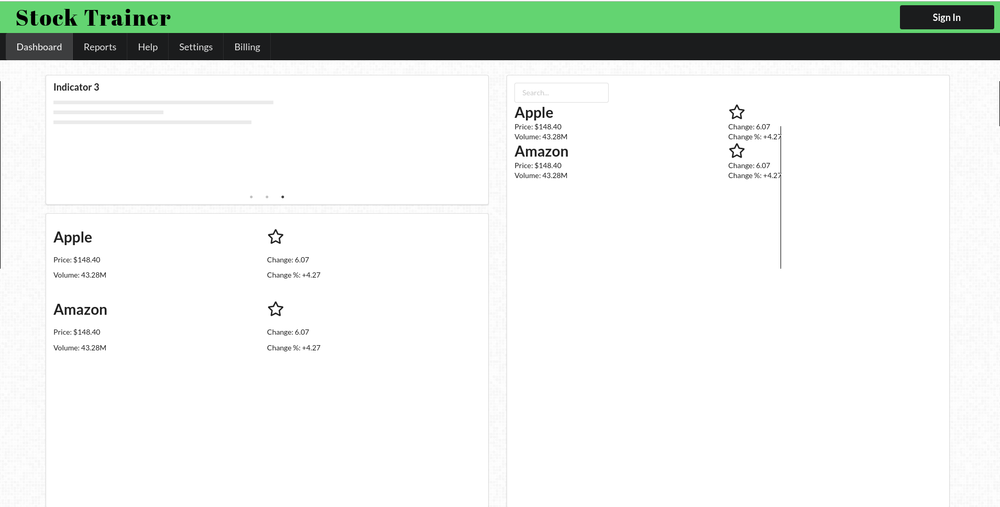
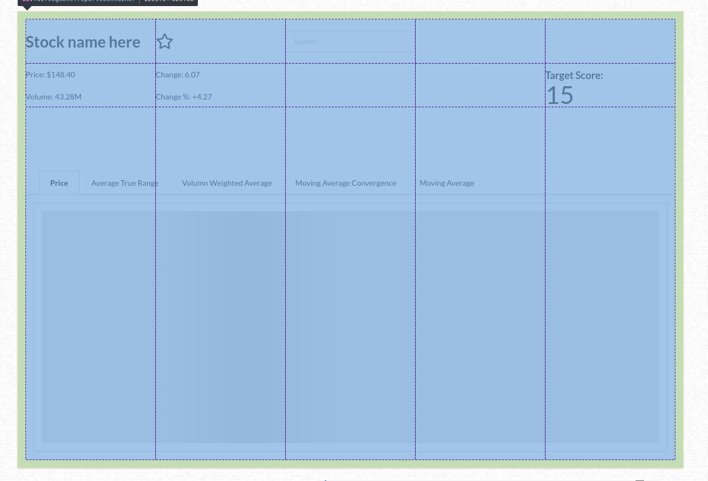
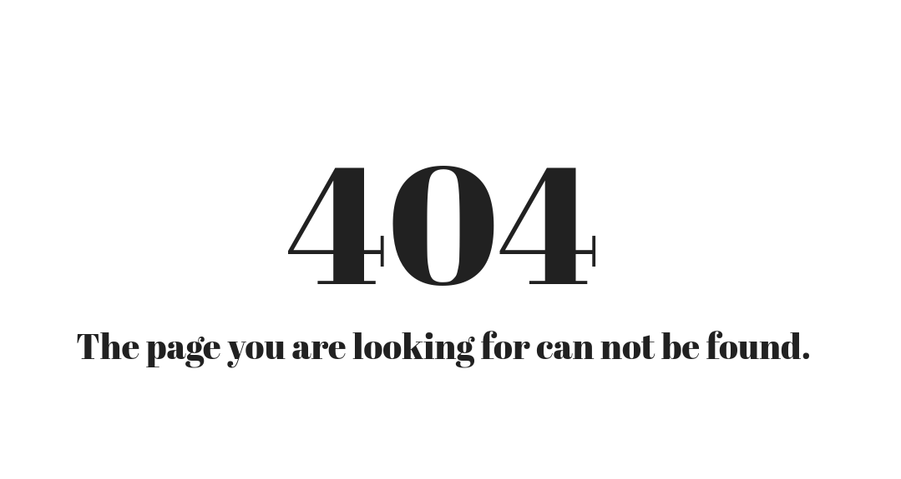

## Accomplishments 

### Whiteboard
[Youtube Link](https://www.youtube.com/watch?v=TYk8q3RGQLA)

### Github
[Repo Link](https://github.com/Lambda-School-Labs/labs9-stock-trainer/graphs/contributors)

My username on Github is [LaikaFusion](https://github.com/LaikaFusion)

### Work Summary
Another busy week. I ended up doing a mix of front end stuff as well as a little bit on the backend. This week I cleaned up a lot of the front end, and documented it. There's a readme in the frontend folder that should explain everything needed to set up. There were a bunch of changes proposed with regards the pages and layout of the site that I put into place this week. Moving the Navbar, adding a help page and removing the targets page are all examples of that. A big chunk of my time this week was spent helping people either debug or create PRs. The biggest was the frontend auth, but I tried to help people get more comfortable with Semantic this week as well.

## Tasks Pulled

### Front End

#### Task 1
CSS changes

##### Github
[Documentation Update](https://github.com/Lambda-School-Labs/labs9-stock-trainer/pull/23)

[Change to CSSgrid](https://github.com/Lambda-School-Labs/labs9-stock-trainer/pull/26)

[NavBar Moved to Top (and additional styling) ](https://github.com/Lambda-School-Labs/labs9-stock-trainer/pull/38)

[404 Page](https://github.com/Lambda-School-Labs/labs9-stock-trainer/pull/53)

##### Trello
[Documentation Update](https://trello.com/c/IlYx3QN5)

[Change to CSSgrid](https://trello.com/c/eKIITO04)

[NavBar Moved to Top (and additional styling) ](https://trello.com/c/jEthd5LA)

[404 Page](https://trello.com/c/e7mUBzyM)

A lot of changes this week to the CSS. These are not final but there's nothing wrong with having a somewhat nice looking site while we're developing. 

#### Task 2
Connected Front End and Back End to pass stock data

##### Github
[Initial Creation of Test Page and Request Function](https://github.com/Lambda-School-Labs/labs9-stock-trainer/pull/35)

[Modification of earlier made piece as well as changes on the backend](https://github.com/Lambda-School-Labs/labs9-stock-trainer/pull/51)

##### Trello
[Trello](https://trello.com/c/jxEDrl2T)

Part of this weeks goals were to display stock api data on the front end. This was my part of that, I both modified the backend view on Django as well as changed the front end to process the data coming back.

#### Task 3
Added a Help articles page
[Github Link](https://github.com/Lambda-School-Labs/labs9-stock-trainer/pull/40)
[Trello](https://trello.com/c/hyhgihP8)

We decided it would be a good idea to have a page with info about various stock terms that we could link to from throughout the site. This is a basic implementation of that.

#### Task 4
Front End Auth0 fixes
[Github Link](https://github.com/Lambda-School-Labs/labs9-stock-trainer/pull/43)
[Trello](https://trello.com/c/ZlCgAeXX)

While this is not my PR, I did spend a good chunk of time working on this. It was the steps needed to get the Auth0 working on our frontend.

#### Task 5
Fixing Netlify CD
[Trello](https://trello.com/c/sdHiQxRc)

This week Netlify continuous deployment was broken starting on Monday. It was able to be fixed quickly. Other Netlify tasks included configuring the env variables.

### Back End

See Task 2 above

## Detailed Analysis

CSS changes

##### Github
[Documentation Update](https://github.com/Lambda-School-Labs/labs9-stock-trainer/pull/23)

[Change to CSSgrid](https://github.com/Lambda-School-Labs/labs9-stock-trainer/pull/26)

[NavBar Moved to Top (and additional styling) ](https://github.com/Lambda-School-Labs/labs9-stock-trainer/pull/38)

[404 Page](https://github.com/Lambda-School-Labs/labs9-stock-trainer/pull/53)

##### Trello
[Documentation Update](https://trello.com/c/IlYx3QN5)

[Change to CSSgrid](https://trello.com/c/eKIITO04)

[NavBar Moved to Top (and additional styling) ](https://trello.com/c/jEthd5LA)

[404 Page](https://trello.com/c/e7mUBzyM)

I made a number of changes this week to the front end. Some of it like CSSgrid was done to make others have an easier time inserting components into the page. Others were more about vanity like adding color to the top bar. 

As pictured, the horizontal nav makes it much easier for us to transition to a mobile layout later on. There was a bit of oddity with the old way of spacing before too due to how the components stacked. Other changes like the coloring and font only took a few minutes to do but make the whole app much better. The color was picked via a random generator with all other colors being built into Semantic.

This is the CSS Grid layout for the reports page. I found it hard to control Semantics Grid, and so I turned to CSS Grid. This is a rather new technology for CSS. It should make it easier for the group to put things on the page without breaking things. The common advice of grid being for 2d, and flexbox is for 1d holds. There is still plenty of flexbox usage on our site.

A 404 page is a simple addition to our site that makes it a lot nicer when testing routes to know if your component is actually being loaded or you're not on the right page.

## Milestones

### Team

I'm tired, this has been a long week. We had 3 apis to integrate and we're now down a member. Stripe went easy enough the team cranked that out and had it tested within a day or two. The trouble was the stock api, and Auth0. The stock api was left to Punit who assured us it'd be done quickly. 

We should have clarified with Punit the exact part of it he was working on. Once we finally checked it turned out he had been working on more than we thought. This included a duplication of work I had done earlier in the week. After some more explicit instructions, he came back with a PR and let me proceed to hook the two together. 

On the auth front we had Haywood and Taylor working on it with help from both Jun and myself. Taylor needed a lot of help with the concepts props in React. Part of this issue likely stems from the particular linting setting we're using, which requires destructuring. This can be confusing when you're not used to it. Perhaps it should be turned off. 

On the backend part of auth I'm not 100% where we are with it. I know the axios request was written yesterday and that Haywood had PR that was related to it. It seems that Jun and Taylor are currently working on fixing that or rewriting it. 

Over the week I've been trying to help whoever asks for it. I wish our group actually used the twenty minute rule more. It seems like we keep running into problems with someone getting stuck and not letting anyone know. I know our team is good, and someone probably knows something related. 

### Proofs

[Stock API Proof](https://stock-trainer.netlify.com/testrequest)

[Auth0 Proof](https://stock-trainer.netlify.com/) - Click signin

[Billing Proof](https://stock-trainer.netlify.com/settings) - Can be tested with `4242 4242 4242 4242` as card number, `06/20` as expiration, CVC as `123`, and zipcode as `90210`

*That's it for this week. Next week is going to be great!*