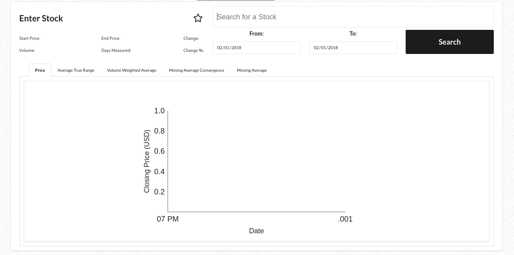
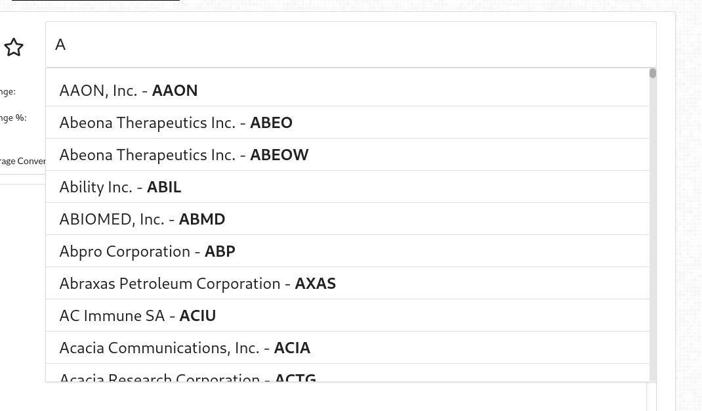
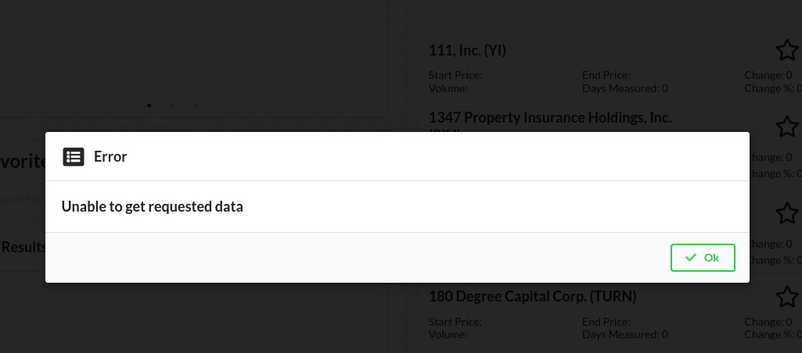

## Accomplishments 

### Github
[Repo Link](https://github.com/Lambda-School-Labs/labs9-stock-trainer/graphs/contributors)

My username on Github is [LaikaFusion](https://github.com/LaikaFusion)

### Work Summary
The rush towards feature completeness was long this week. We lost a few more members which didn't help. The work broke down with me doing mostly frontend components and wiring everything together. In some ways it's easier with less people, you can do bigger chunks and not worry about stepping on peoples toes. On the other you're pretty much the only one who understands your part of the site so it's a bit slower to bounce ideas off people. This week I completed almost every major unfinished component with the exception of the live stock ticker. 

## Tasks Pulled

### Front End

#### Task 1
Stock API Requests (Frontend)

##### Github
[Stock frontend expansion](https://github.com/Lambda-School-Labs/labs9-stock-trainer/pull/58)

To compliment the changes to the backend this was modifications to the front end that allowed the changes to be accessed there. Most of it had to do with requesting time periods, and specific data.

#### Task 2
Reusable Searchable Stock List 

##### Github
[Favorites component](https://github.com/Lambda-School-Labs/labs9-stock-trainer/pull/62)

[Stock ticker](https://github.com/Lambda-School-Labs/labs9-stock-trainer/pull/64)

The goal of these was to create a reusable component that allowed searching and displaying of stock cards.

#### Task 3
Added functionality to the reports page allowing searching

##### Github
[Reports top half](https://github.com/Lambda-School-Labs/labs9-stock-trainer/pull/68)

[Date fixes](https://github.com/Lambda-School-Labs/labs9-stock-trainer/pull/74)

Our reports page needed a way to search for data to pass to the charts. This accomplished that. Later I came back and added more restrictions to fit with our data set.

#### Task 4
Add ability to favorite stocks
[Frontend favorites](https://github.com/Lambda-School-Labs/labs9-stock-trainer/pull/72)

Pretty simple, added a button to send a stock symbol to the backend to add it to the favorites list. 

### Back End

#### Task 1
Stock API Requests (Frontend)

##### Github
[Stock backend expansion](https://github.com/Lambda-School-Labs/labs9-stock-trainer/pull/57)

This was changes to the route on the backend to allow more flexibility delivering data as well as documentation to the format data comes in.

## Detailed Analysis

Added functionality to the reports page allowing searching

##### Github
[Reports top half](https://github.com/Lambda-School-Labs/labs9-stock-trainer/pull/68)

[Date fixes](https://github.com/Lambda-School-Labs/labs9-stock-trainer/pull/74)

This realistically should have been multiple PRs. Since I was the only one working on it, I just did them all in one. The full list of what was added in the first PR is:
- An error modal on the main page if an axios request fails
- Auto suggest search to the reports page
- Route changes to handle a parameter of a stock symbol which will be used by the page
- Updates to Stock.jsx, to handle more fields and styling
- New search button on reports page
- start and end date selectors
- Misc css tweaks to all of the above
- Reports can make and read requests from the backend

The first issue was how to specify what you wanted to search. Jun had made an auto suggest sort last week, and moving it onto the page was relatively trivial. Next was the start date and end date fields. Lastly the button was added to allow the search to kick off. Care was taken, and later expanded on in the Date fixes pr to make sure that the user can't enter invalid data and if something goes wrong they aren't kept in the dark. 

Trying to keep the user from selecting invalid data was one of the concentrations in this PR because our users aren't going to know what mistake they're making. All the kinks aren't worked out, for example you can select times before a stock exists. Google wasn't on the market in 1998 for example. Others are easier but not implemented yet such as holidays. Weekends are disallowed though and push the selection to the next monday.

This error message will come up anytime the frontend receives an error from an axios request. Future plans may be making it easier to figure out exactly why it happened.

## Milestones

### Team

At the rate of about one person a week we've been consistently losing people. Some were unexpected. Our group has three members left. As such our team work this week was easy! Three people isn't really herding cats, and there's so much work to be done conflicts in what we're working on are rare. 

Being down people also means less workers. There's a simple solution work more. Jun has been a particular good sport about this, wading into the depths of Django without much knowledge. His documentation of endpoints has been... on point. It makes it easy to develop a front end feature even before he's finished and I'm able to test.

Taylor seems to be struggling. This is the second week in a row someone has had to help her with her main task. In this case Jun had to come in and do charting. I think it may have something to do with her also being a PM and having other responsibilities. 

Jun just got an offer which is great! But that means he has less time to work. Luckily it's happened concurrently with the project winding down. There's still a bunch to do but nothing as major as this week.

### Proofs

[Our site](https://stock-trainer.netlify.com/) - All things discussed are merged and work on our live site.

*That's it for this week. Next week is going to be great!*
