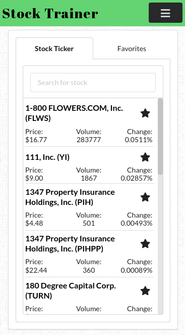
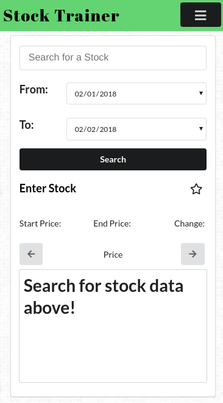
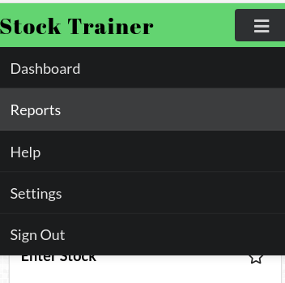

 

---
title: Week 3 Blog Entry
date: '2019-02-01T11:20:00'
---

## Accomplishments 

### Github
[Repo Link](https://github.com/Lambda-School-Labs/labs9-stock-trainer/graphs/contributors)

My username on Github is [LaikaFusion](https://github.com/LaikaFusion)

### Work Summary
The majority of my work this week was on the CSS of the site. Everything from the mobile version to the styling on the chart. In my opinion the whole site looks pretty good, but I may be a bit biased. We have a minimal amount of tweaks left to do on the site. Everyone else seemed to really step up their game when it came to this site.

## Tasks Pulled

### Front End

#### Task 1
Mobile CSS

##### Github
[Mobile CSS](https://github.com/Lambda-School-Labs/labs9-stock-trainer/pull/81)

This was a rather extensive PR. For mobile quite a few elements had to be changed or otherwise modifed to fit into the smaller screen size. The reports page in particular required a new selection method to be made to allow chart selection in the mobile view.

#### Task 2
CSS Tweaks

##### Github
[Css bug fixes](https://github.com/Lambda-School-Labs/labs9-stock-trainer/pull/83)

[made css changes](https://github.com/Lambda-School-Labs/labs9-stock-trainer/pull/85)

[Css tweaks](https://github.com/Lambda-School-Labs/labs9-stock-trainer/pull/92)

[Chart modification](https://github.com/Lambda-School-Labs/labs9-stock-trainer/pull/95)

These are all variations on the same thing. Just making the site look better. Some are more extensive changes then others.

#### Task 3
Add search to the help page

##### Github
[Reports top half](https://github.com/Lambda-School-Labs/labs9-stock-trainer/pull/89)

This was just finishing off the final page that needed search. It was added and works.

#### Task 4
Required auth on most routes
[Routerauthrestrict ](https://github.com/Lambda-School-Labs/labs9-stock-trainer/pull/88)

This added a requirement to be authroized to see many of the routes on our site. 

## Detailed Analysis

Mobile CSS

##### Github
[Mobile CSS](https://github.com/Lambda-School-Labs/labs9-stock-trainer/pull/81)

This was a rather extensive PR. For mobile quite a few elements had to be changed or otherwise modifed to fit into the smaller screen size. The reports page in particular required a new selection method to be made to allow chart selection in the mobile view.

This realistically should have been multiple PRs. Since I was the only one working on it, I just did them all in one. The full list of what was added in the first PR is:
- A lot of height adjustment
- Change of the stock card element
- Added a mobile nav bar that fades in and out
- Chagned signout button to a menu button
- Chart changes size
- Mobile layouts for dashboard and reports
- Misc css tweaks to all of the above
- Font size and styling changes

This was switched to a tabbed interface to allow ease of use on mobile. The font sizes were adjusted as well to make everything fit.

The reports page was mostly horizontal before. This was changed to vertical for the mobile version. Everything was balanced and the fonts  resized to fit.

This is a drop down menu that allows easy navigation of the site on mobile. Having a fixed one took up too much space.

## Milestones

### Team

We worked hard this week. In a way we sped up a lot when we lost people. Part of it is it's easy to know what you and everyone else is doing. The other is you can do bigger chunks at once without worrying about messing with anyone else code. I seem to be directing work and maintianing a feature list. The trello isn't really touched but isn't needed as much. It's a graveyard of old ideas anyway. We're all switching focus onto other things. Whiel we could dump more time into this site, finding a job is deemed more important by us now.

### Proofs

[Our site](https://stock-trainer.netlify.com/) - All things discussed are merged and work on our live site.

*That's it for this week. Next week is going to be great!*