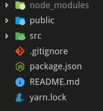

Many people use create-react-app as an easy starting place to creating their React app. Some do not know exactly everything that comes with it, or why it is there. This is an article for those people, the ones who don’t know everything happening under the hood but want to learn more.

First off I will preface this by saying this was written with create-react-app 2.1.5 and therefore things might have changed by the time you read this.

After first run with `npx create-react-app yourApp`you will find your app folder has three folders and 4 files. The folders are `node_modules/` , `public/`, and `src/`. The files are `.gitignore`, `package.json,README.md`, and `yarn.lock`

## Running Create React App

Let’s break down what you actually just did. The first line in the output is from `npx`. There are two things npx can do when you give it command. It first looks on your local machine for the package to run. If it doesn’t find one, it then starts looking at npm’s package list. The first message in the output is just letting you know that it handled getting.

Next inside create-react-app (here after CRA), your command runs through a series of checks. It finds information about your system, looks if you have any flags attached, and makes sure you specified a folder to output. Then the actual `createApp` function runs. This checks to see if the directory you choose is a safe one. It does this by looking for things like log files. If you fail any check you will receive an error message and then CRA will exit.

Next it begins to form the `package.json` with the default values of `name:<YOURAPP'SNAME>`, `version: '0.1.0'`, and `private: true`. This is written to the directory you specified. Here it determines if it should use `yarn` or `npm` based on what you have on your system. If you have `yarn` installed that will be used. A series of checks is run on the versions of `node` , `yarn`, and `npm` to select the correct version of `react-scripts` to use.

The next function is called `run()`. This continues the installation. Right now the only thing that has appeared for you is the npx line and “Creating a new React app in &lt;YOURDIRECTORY&gt;”. The dependency list is created. By default this includes: `react, react-dom`, and the version of `react-scripts` you specified. If you have the Typescript flag added it will add the dependencies for that as well.

A new line is written to console. “ Installing packages. This might take a couple of minutes.” Using everything previously determined it runs your package manager, to install the correct version of `react-scripts` either from the internet if you’re online or the local cache if you’re not.

This is where the line “Installing react, react-dom, and react-scripts…” appears. The installation is done asynchronously. If it fails package.json, yarn.lock, and node_modules are all deleted after printing a warning.

If everything has succeeded until now we move to a new file: `react-scripts`. The first thing it does is check for `package.json` and `yarn.lock` . It loads the `package.json` into a variable called `appPackage` in json format. It checks if TypeScript is a dependency after it does this. Next it begins adding to the json.

First is the scripts. These will probably be familiar as start, build, test, and eject. These scripts are actually located in the same directory as the init.js we are currently going through. Next is the eslinstConfig then the deafultBrowsers. These are by default ‘&gt;0.2%’, ‘not dead’, ‘not ie &lt;= 11’, ‘not op_mini all’. Basically this means target all browsers that are higher then .2% market share, in active use, not bellow IE 11, or Opera Mini. This is actually a separate package located [here](https://www.npmjs.com/package/browserslist).

The `package.json` is then written out and will not be touched again. As of this point nothing else has been `console.logged`. A readme files is checked for, and if it exists renamed. The files specified in the template folder are then copied to the working directory. This is the `public`, `src` , `README.md`, and `gitignore`. There is no typo here, gitignore is copied over without the . in front then renamed. A comment here notes it’s to prevent an npm bug.

After a check to see if React is actually installed it moves on to checking if the repository has been initialized with git. This runs git init, and adds the first commit. This is where the line “Initialized a git repository” appears.

The last thing init.js does before ending is print the success message and instructions. These introduce you to the basic `react-scripts` commands and suggest you cd into the directory you just created.

## The Many Dependencies of Create React App (and what they do)

The question then turns to, well what did `react`, `react-dom`, and `react-scripts` bring with them? For `react` and `react-dom` the list is identical. `loose-envify`, `object-assign`, `prop-types`, and `scheduler.`

* [`loose-envify`](https://github.com/zertosh/loose-envify) — This replaces process.env variables 

* [`object-assign`](https://www.npmjs.com/package/object-assign) — Object.assign() for unsupported browsers/node versions

* [`prop-types`](https://www.npmjs.com/package/prop-types) — Type checker for React props

* [`scheduler`](https://www.npmjs.com/package/scheduler) — React’s own scheduler

Looking at these four you may be wondering why your node_modules folder is so big. That comes down to `react-scripts`. 

It’s dependency list is:

~~~~
“@babel/core”: “7.2.2”, 
“@svgr/webpack”: “4.1.0”, 
“babel-core”: “7.0.0-bridge.0”, 
“babel-eslint”: “9.0.0”, 
“babel-jest”: “23.6.0”, 
“babel-loader”: “8.0.5”, 
“babel-plugin-named-asset-import”: “0.3.1”, 
“babel-preset-react-app”: “7.0.1”, 
“bfj”: “6.1.1”, 
“case-sensitive-paths-webpack-plugin”: “2.2.0”, 
“css-loader”: “1.0.0”, 
“dotenv”: “6.0.0”, 
“dotenv-expand”: “4.2.0”, 
“eslint”: “5.12.0”, 
“eslint-config-react-app”: “3.0.7”, 
“eslint-loader”: “2.1.1”, 
“eslint-plugin-flowtype”: “2.50.1”, 
“eslint-plugin-import”: “2.14.0”, 
“eslint-plugin-jsx-a11y”: “6.1.2”, 
“eslint-plugin-react”: “7.12.4”, 
“file-loader”: “2.0.0”, 
“fs-extra”: “7.0.1”, 
“html-webpack-plugin”: “4.0.0-alpha.2”, 
“identity-obj-proxy”: “3.0.0”, 
“jest”: “23.6.0”, 
“jest-pnp-resolver”: “1.0.2”, 
“jest-resolve”: “23.6.0”, 
“jest-watch-typeahead”: “0.2.1”, 
“mini-css-extract-plugin”: “0.5.0”, 
“optimize-css-assets-webpack-plugin”: “5.0.1”, 
“pnp-webpack-plugin”: “1.2.1”, 
“postcss-flexbugs-fixes”: “4.1.0”, 
“postcss-loader”: “3.0.0”, 
“postcss-preset-env”: “6.5.0”, 
“postcss-safe-parser”: “4.0.1”, 
“react-app-polyfill”: “0.2.1”, 
“react-dev-utils”: “7.0.3”, 
“resolve”: “1.10.0”, 
“sass-loader”: “7.1.0”, 
“style-loader”: “0.23.1”, 
“terser-webpack-plugin”: “1.2.2”, 
“url-loader”: “1.1.2”, 
“webpack”: “4.28.3”, 
“webpack-dev-server”: “3.1.14”, 
“webpack-manifest-plugin”: “2.0.4”, 
“workbox-webpack-plugin”: “3.6.3”`
~~~~

Well that escalated quickly. Let’s break this down.

### Babel

Babel transforms your code. That is to say it will do things like add polyfills which makes your ES2015+ code work with older browsers. The package.json defines it’s targets through *browserslist.*

* [`@babel/core`](https://babeljs.io/docs/en/next/) — The core library for Babel
* [`*babel-core`](https://www.npmjs.com/package/babel-core) — *Since version 7 of Babel the naming scheme changed. Not everything was updated and this is left to serve as a bridge for those packages that have not yet updated to the new @ naming 
* [`babel-eslint`](https://github.com/babel/babel-eslint) — A ruleset that allows you to run eslint on Babel parsed code
* [`babel-jest`](https://www.npmjs.com/package/babel-jest) — Allows Jest(a testing library for JS) to play nicely with Babel 
* [`babel-loader`](https://github.com/babel/babel-loader) — A loader that tells Webpack (we’ll get to Webpack) to run Babel preprocessor on the code 
* [`babel-plugin-named-asset-import`](https://www.npmjs.com/package/babel-plugin-named-asset-import) — A CRA specific plugin that allows named imports 
* [`babel-preset-react-app`](https://www.npmjs.com/package/babel-preset-react-app) — This is the preset file for Babel that CRA uses

### ESLint

ESLint is a linter meaning that is scans your code against a set of rules. If you violate one of these rules it warns you. These warnings are the cause of many of CRA’s errors in console.

* [`eslint`](https://github.com/eslint/eslint) — Base library for ESLint 
* [`eslint-config-react-app`](https://www.npmjs.com/package/eslint-config-react-app) — CRA’s default ESLint rules 
* [`eslint-loader`](https://www.npmjs.com/package/eslint-loader) — Similar to Babel-loader above, this allows ESLint to be run by WebPack 
* [`eslint-plugin-flowtype`](https://www.npmjs.com/package/eslint-plugin-flowtype) — Adds flowtype syntax to ESLint 
* [`eslint-plugin-import`](https://www.npmjs.com/package/eslint-plugin-import) — Adds linting support for ES2015+ import/exports
* [`eslint-plugin-jsx-a11y`](https://www.npmjs.com/package/eslint-plugin-jsx-a11y) — Enforces accessibility rules for things like screen readers in JSX 
* [`eslint-plugin-react`](https://www.npmjs.com/package/eslint-plugin-react) — Adds ESLint rules for React

### Jest

Jest is a testing library for Javascript. It is also made by Facebook like CRA and React

* [`jest`](https://www.npmjs.com/package/jest) — The base dependency for Jest 
* [`jest-pnp-resolver`](https://github.com/arcanis/jest-pnp-resolver) — Adds [Plug’n’Play](https://gist.github.com/arcanis/02b49752c385908479734d8027d7a6c7) support to Jest 
* [`jest-resolve`](https://www.npmjs.com/package/jest-resolve) — This is a Facebook adding something to Jest. I’m sorry I have no better details but there isn’t a readme, and the code doesn’t have an explanation in the repo 
* [`jest-watch-typehead`](https://www.npmjs.com/package/jest-watch-typeahead) — Allows filtering of Jest tests

### PostCSS

PostCSS allows rules to be applied to your CSS files. An easy example is it can add vendor prefixes to your CSS to save you the effort of doing so.

* [`postcss-flexbugs-fixes`](https://www.npmjs.com/package/postcss-flexbugs-fixes) — Fixes browser specific flexbox bugs 
* [`postcss-loader`](https://www.npmjs.com/package/postcss-loader) — Add a loader to Webpack that runs PostCSS 
* [`postcss-preset-env`](https://www.npmjs.com/package/postcss-preset-env) — Adds polyfills to allow newer CSS to work on older browsers that lack that feature 
* [`postcss-safe-parser`](https://www.npmjs.com/package/postcss-safe-parser) — Finds and fixes CSS errors

### Webpack

A highly modifiable tool that bundles JS files. As you can see from the high number of dependencies in this list, there are quite a few uses for this. Webpack is also what runs Babel, ESLint and PostCSS.

* [`@svgr/webpack`](https://www.npmjs.com/package/@svgr/webpack) — Transforms SVGs to React components 
* [`case-sensitive-paths-webpack-plugin`](https://www.npmjs.com/package/case-sensitive-paths-webpack-plugin) — Stops case sensitive operating systems and non case sensitive ones from causing issues for each other 
* [`css-loader`](https://www.npmjs.com/package/css-loader) — Allows @import url() to work in CSS files 
* [`file-loader`](https://www.npmjs.com/package/file-loader) — Resolves import/require urls and adds the file to the directory
* [`html-webpack-plugin`](https://www.npmjs.com/package/html-webpack-plugin) — Creates an HTML file of all your webpack bundles 
* [`mini-css-extract-plugin`](https://www.npmjs.com/package/mini-css-extract-plugin) — Creates a CSS file per JS containing CSS 
* [`optimize-css-assets-webpack-plug`](https://www.npmjs.com/package/optimize-css-assets-webpack-plugin) — Uses [cssnano](https://github.com/cssnano/cssnano) to minify and optimize CSS code 
* [`pnp-webpack-plugin`](https://www.npmjs.com/package/pnp-webpack-plugin) — Yarn Plug’n’Play plugin for Webpack 
* [`sass-loader`](https://www.npmjs.com/package/sass-loader) — This allows Webpack to turn Sass into normal CSS files. Works with `css-loader` above to output files 
* [`style-loader`](https://www.npmjs.com/package/style-loader) — Adds CSS to style tags 
* [`terser-webpack-plugin`](https://www.npmjs.com/package/terser-webpack-plugin) — Allows minification of Javascript 
* [`url-loader`](https://www.npmjs.com/package/url-loader) — Transforms files into base64 URIs. This allows you to not have to request a second file, as the data is transferred in the HTML document 
* [`webpack`](https://www.npmjs.com/package/webpack) — What everything else here plugs into. Allows transformation and bundling of JS files 
* [`webpack-dev-server`](https://www.npmjs.com/package/webpack-dev-server) — Adds live reloading to Webpack. This means it will run everytime you save 
* [`webpack-manifest`](https://www.npmjs.com/package/webpack-manifest-plugin) — Creates a [manifest.json](https://developer.mozilla.org/en-US/docs/Mozilla/Add-ons/WebExtensions/manifest.json) from your files 
* [`workbox-webpack-plugin`](https://developers.google.com/web/tools/workbox/modules/workbox-webpack-plugin) — This is related to the service worker, adding tools to generate, and one that adds to it

### Others

These are non Webpack or Babel related plugins 
* [`bfj`](https://www.npmjs.com/package/bfj) — Big Friendly JSON. It allows parsing of large JSON files without grinding your JS to a halt 
* [`dotenv`](https://www.npmjs.com/package/dotenv) — Allows insertion of process.env variables from .env files 
* [`dotenv-expand`](https://www.npmjs.com/package/dotenv-expand) — Allows variables to be used in JSON format in .env files 
* [`fs-extra`](https://www.npmjs.com/package/fs-extra) — Replacement for Node’s FS methods that adds additional methods 
* [`react-app-polyfill`](https://www.npmjs.com/package/react-app-polyfill) — Adds polyfills for older browsers for things CRA uses 
* [`react-dev-util`](https://www.npmjs.com/package/react-dev-utils) — A utility library maintained by CRA 
* [`resolve`](https://www.npmjs.com/package/resolve) — Adds async support to require.resolve()

As you can see the majority of what `react-scripts` does for you is related to setting up and running Webpack. Almost every other dependency listed here either plugs into Webpack, or plugs into something that plugs into Webpack.

## React Scripts Start

Now that you know what `react-scripts` contains but what about what it does? The most used command is probably `yarn start` or `npm start`. This was defined in package.json as being used to run `react-scripts start`. Here’s what happens next.

First `react-scripts.js` is called starting the process. It looks for args, such as start or test. If it finds a valid argument it then runs `/scripts/<THE ARGUMENT YOU GAVE>.js` which in this case is `start.js.`

After a series of checks, and importations it begins to read the .env file. This checks for a set port, and host IP. Next it looks at the browsers you want to support, makes sure your port is free (if it isn’t you get an option to change it), then runs the createCompiler function.

The createCompiler function is located in the `react-dev-utils` and what it does is create a function that listens for messages from Webpack. This is what outputs to console messages like “Compiling…” and “Failed to compile.” which are familiar to anyone who uses CRA frequently. This is not the actual Webpack config but the method for interfacing with Webpack. A config file is then generated for the WebpackDev server using the config file.

A new instance of the WebpackDevServer from the library of the same name is created, passing in the compiler and configuration. Webpack is run here by the WebpackDevServer. A listener method on the instance is called, passing in the port and host values. This then clears the console and puts up the text “ Starting the development server…”. The browser is opened with the correct dev URL. Lastly two listeners are added for when the process is killed, which turns off the web server, and exits the start.js process.

I hope you enjoyed this look into Create React App and now see it as a little bit less of a black box. There’s more to it then just what was described here, for example build, test, and eject scripts aren’t covered. As always if I got anything wrong or something changed let me know.