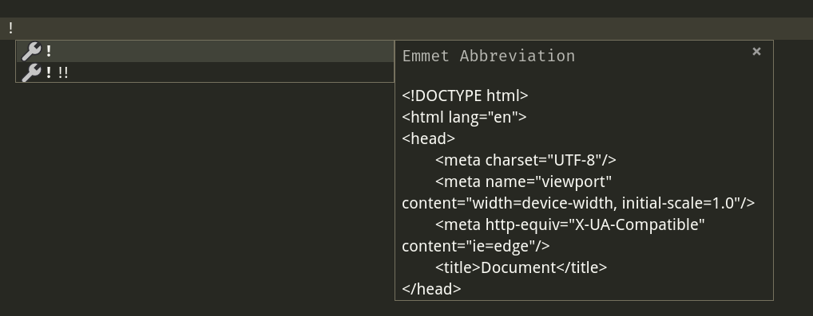

Let me start by answering the title. There isn’t an Emmet and the person who wrote Emmet is named Sergey Chikuyonok. In fact the whole thing didn’t even used to be called Emmet, it started as Zen Coding. The rename happened in 2012.

Now that we got that out of the way a brief idea of what Emmet is. Emmet is a way to save you keystrokes when creating HTML and CSS. You likely have seen it as it is either a plug-in or part of every major code editor currently in existence. Visual Studio Code? Yup. Also Vim, Emacs, Atom, Notepad++, Sublime Text and even Dreamweaver. You may have ever stumbled across some of these by accident.

Currently Emmet issupported on `html`, `haml`, `jade`, `slim`, `jsx`, `xml`, `xsl`, `css`, `scss`, `sass`, `less` and `stylus` in Visual Studio Code. It is possible to add support to other types of documents. For example almost every picture used here was done in a JSX document. Vue needs an extension but it is also supported.

### Abbreviations

This is great if you’re like me and like to go fast when making divs but it’s only the start of what you can do. Just type a tag and have both the opening and closing with your cursor resting in the middle.

But what good is just a div? You can easily add class (or classNames if you’re in jsx like I am here) and IDs. Classes are just . and ids are # just like in CSS.

There’s no restriction to how many you can chain onto this. If you need twenty class names just get typing and it will happen.

I can hear your objections already. Your brilliance needs more than just classes and IDs. Your UI framework demands nothing less. Luckily you can do that. Anything between [] will just be added as an attribute to the tag. This of course can combined with things like class and ID as well.

Here it is being demod on an anchor tag. Also of note in this example is the {} which places text in between the opening and closing tag.

### Nesting

Why stop at just one tag though? While you can place text between tags with {}s this won’t work out into allowing more expansions.

What you need in this case is the &gt; character. This will let you insert another set of tags between the set to the left. All the previous things also work allowing you to write entire chunks in one line.

I hear you. You don’t want to have to type out every item in a list. There’s a way around that too. Just adding *5 will cause the element to be repeated five times.

In addition to that you can also automatically add numbers by inserting a $ as either a class (.) or ID (#). This can be part of a string as well such as item$. This will not work for the inner text however.

### HTML

This is great for formatting but what about the tags themselves. Most of my above examples are with divs. There are many more abbreviations you can use. Things like img or a will expand a snippet that you can easily tab to fill in. That is your cursor will be left in between the quotes next to href, and hitting tab will put your cursor between the tags.

Some tags have extensions. Ones with types particularly. Input example is above. You can also do passwords (:p), checkboxes (:c), or dates (:dates). Every type of input is there.

! will just insert an HTML5 document. There’s a few other variations but this probably the most useful and also the shortest.

Lorem ipsum is also an Emmet abbreviation. This works for other commands too. You can multiply it with *5 for example.

### CSS

Not just HTML, there’s also a number of CSS rules for Emmet. There is quite a lot of them so I’m going to go through a few. The CSS suggestions use something called Fuzzy Search. What this means for you is if you get a rough approximation of what you want it will probably be suggested.

Here is an example using display:flex. Just typing df is enough to trigger it the colon is not needed. Notably this won’t work for grid, and a bunch of related grid properties as of March 2019.

If you add a number after a tag, for example width above, then a number it defaults to pixels as a unit. This doesn’t mean you’re limited to pixels however any unit will work, w100e will be enough to turn it to width:100em. This remains true of any property. The color example above would be in pixels as well if that were base ten numbers, and didn’t have the #.

If you need them you can also do browser prefixes with Emmet by adding the - in front of the tag.

### Wrapping Up

As you can see there is quite a lot to Emmet. Remembering them all can be hard. There is a [cheat sheet](https://docs.emmet.io/cheat-sheet/) but it might be better to just use the ones that feel natural. If you find yourself liking them it is possible to add your own snippets that may be more useful to you. Adding snippets however is an article for another time.